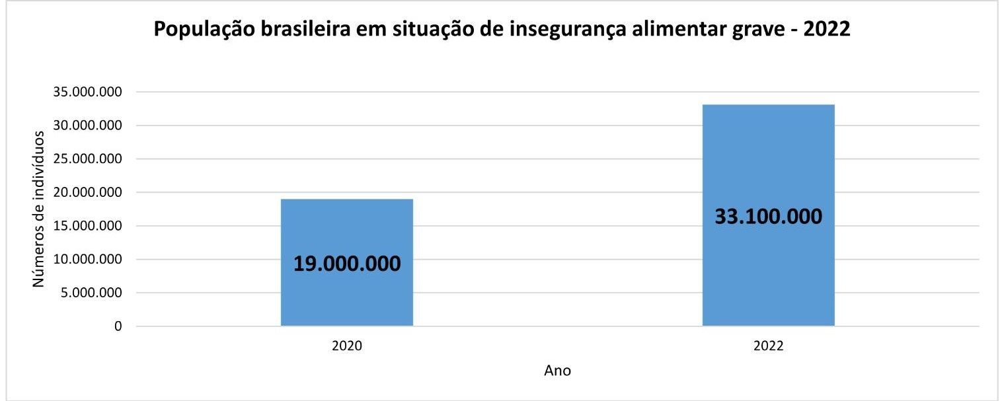

<p align="center">
  
</p>
<br>

<b><h1>Mercado Solidário</h1></b>

## TEMA:

Segurança alimentar e nutricional a todes!<br><br>

## JUSTIFICATIVA:

Retorno do Brasil ao Mapa da Fome da ONU (2022).

<p align="justify">O número de pessoas em insegurança alimentar grave no Brasil, ou seja, <b>PASSANDO FOME</b>, quase duplicou em menos de dois anos.</p>

<p align="justify">A insegurança alimentar acontece quando as pessoas não têm acesso regular e permanente a alimentos em quantidade e qualidade suficiente para sua sobrevivência, como define a Organização das Nações Unidas para a Alimentação e a Agricultura (FAO). Isso quer dizer que a pessoa em estado de insegurança alimentar passa por incertezas de quando, como e quanto irá comer em sua próxima refeição, colocando em risco sua nutrição, saúde e bem-estar. </p>
<p align="justify"> Pesquisa: Vigisan (Inquérito Nacional Sobre Segurança Alimentar no Contexto da Pandemia Covid-19 no Brasil) levantamento pela Rede Brasileira de Pesquisa em Soberania e Segurança Alimentar e Nutricional, divulgada em 08/06/2022, revelou que 15,5% da população estão passando fome. Em 2020, quando foi realizada a primeira pesquisa deste tipo, correspondia a 9,1% da população. </p><br>

<p align="center"></img></p><br>
 
<p>Fonte: Agência Senado</p>

<p>Link de acesso: https://www12.senado.leg.br/noticias/infomaterias/2022/10/retorno-do-brasil-ao-mapa-da-fome-da-onu-preocupa-senadores-e-estudiosos#:~:text=Em%202022%2C%20o%20Segundo%20Inqu%C3%A9rito,brasileiros%20em%20situa%C3%A7%C3%A3o%20de%20fome.</p> 

<br>

## PÚBLICO-ALVO:

✘ Doadores<br>
✘ População vivenciando a insegurança alimentar e nutricional<br>
✘ Voluntários para implementação e manutenção do projeto<br>
✘ Centro de Referência de Assistência Social<br>
<br>

## 🎯OBJETIVO:

<p align="justify">✘ Inibir a ocorrência da insegurança alimentar e nutricional das famílias cadastradas através da disponibilização do acesso permanente de alimentos; <br> ✘ Inspirar novas ações e estratégias para erradicar a fome;<br> ✘ Ampliar o número de famílias beneficiadas.</p><br>


## RESUMO DO PROJETO:

<p align="justify">O mercado solidário foi criado para ajudar as famílias que estão vivenciando situação de insegurança alimentar e nutricional, sendo a sua estrutura similar ao mercado convencional. Nesta iniciativa, a família poderá comprar produtos de acordo à sua escolha e necessidade, a partir da utilização de cartão-alimentação com valor máximo de 130 pontos mensais.</p>

<p align="justify">Os produtos terão pontuações simbólicas e por isso possibilitará a compra equivalente ao dobro de produtos de uma cesta básica. Além do cartão-alimentação, a iniciativa buscará apoio do Centro de Referência de Assistência Social (CRAS), do respectivo município do mercado, para direcionar e ofertar serviços da Assistência Social no SUAS (Sistema Único de Assistência Social) enviando os cadastros das famílias.</p> 

<p align="justify">O Mercado Solidário contará com doações, em produtos, para abastecimento do estoque e será dividido em 4 bancos. O primeiro banco será destinado ao cadastro de voluntários para implementação e manutenção do projeto. O segundo irá cadastrar as famílias beneficiárias à iniciativa, o terceiro as doações e o quarto será o mercado e o seu estoque.</p>

<br>

Cartão-Alimentação:
<p align="center"></img></p>
<p align="center"></img></p><br>

Formulário Voluntariado: (inserir front)
1. name
2. cpf
3. telefone
4. email
5. disponibilidade_dia
6. disponibilidade_turno
7. password
<br><br>

## ⚙️FUNCIONALIDADES:

➤ Voluntários<br>

✘ Cadastramento de voluntários;<br>
✘ Listar os cadastros de todos voluntários da API;<br>
✘ Listar os voluntários por filtros (disponibilidade_dia e disponibilidade_turno);<br>
✘ Buscar o voluntário por Id;<br>
✘ Buscar o voluntário por CPF;<br>
✘ Login do voluntário;<br>
✘ Atualizar o cadastro do voluntário;<br>
✘ Deletar o cadastro do voluntário;<br><br>

➤ Famílias Beneficiárias<br>

✘ Cadastrar as famílias;<br>
✘ Listar os cadastros de todas as famílias da API;<br>
✘ Traçar o perfil socioeconômico<br>
✘ Buscar a família por representante familiar;<br>
✘ Buscar a família por número do cartão-alimentação;<br>
✘ Atualizar o cadastro da família;<br>
✘ Deletar o cadastro da família;<br><br>

➤ Doações<br>

✘ Cadastrar a doação de produtos;<br>
✘ Listar as doações por filtros (nome do produto, mês e categoria);<br>
✘ Buscar a doação por Id;<br><br>


➤ Mercado<br>

✘ Listar estoque da API;<br>
✘ Compra da família;<br>
✘ Listagem dos produtos por filtros (nome do produto/quantidade e categoria);<br>
✘ Atualizar o cadastro do produto;<br>
✘ Deletar o produto;<br>
<br>

## 💻MÉTODOS:
<p align="justify">API desenvolvida utilizando JavaScript e Node.js. Possui CRUD e utiliza a conexão com bando de dados MongoDB e as rotas foram testes no Insominia.</p><br>


## 📂 ARQUITETURA MVC
```
📁MERCADO-SOLIDARIO
|
|- 📁 assets
|- 📁 src
| |
| |- 📁 controllers
| |- 📑 authController.js
| |- 📑 voluntarioController.js
|
| |- 📁 database
| |- 📑 mongoConfig.js
| |- 📁 middlewares
| |- 📑 auth.js
| |- 📁 models
| |- 📑VoluntarioSchema.js
|
| |- 📁 routes
| |- 📑voluntarioRoutes.js
| |- 📁 test
| |- 📑app.test.js
| |- 📑jest.setup.js
| |- 📑 app.js
|
|- 📑 .env
|- 📑 .env.example
|- 📑 .gitignore
|- 📑 package-lock.json
|- 📑 package.json
|- 📑 README.md
|- 📑 server.js
```
<br>

## TECNOLOGIAS E PACOTES UTILIZADOS:


**TECNOLOGIAS**

- [Git/GitHub](https://github.com/)
- [Vercel](https://vercel.com/)
- [JavaScript](https://www.javascript.com/)
- [MongoDB Atlas](https://www.mongodb.com/cloud/atlas)
- [Node.js](https://nodejs.org/en/)
- [Insominia](https://insomnia.rest/)
- [VScode](https://code.visualstudio.com/)  
- [Canva](https://www.canva.com/)
- [HTML](https://developer.mozilla.org/pt-BR/docs/Web/HTML)
- [CSS](https://developer.mozilla.org/pt-BR/docs/Web/CSS)

### PACOTES


- [Cors](https://www.npmjs.com/package/cors)
- [Dotenv-safe](https://www.npmjs.com/package/dotenv)
- [Express](https://expressjs.com/pt-br/)
- [Mongoose](https://mongoosejs.com/)
- [Nodemon](https://www.npmjs.com/package/nodemon)
- [Bcrypt](https://www.npmjs.com/package/bcrypt)
- [Jsonwebtoken](https://www.npmjs.com/package/jsonwebtoken)
- [Jest](https://www.npmjs.com/package/jest)
- [Supertest](https://www.npmjs.com/package/supertest)

<br>

# ROTAS

<br><br>

## 🏗️ IMPLEMENTAÇÕES FUTURAS:
<input type="checkbox"></input>
Desenvolver um front-end;
<br><br>

## CONHEÇA UM POUCO SOBRE MIM:


|||
|:------:|----|
|  | <p align="justify">Meu nome é Grazielle Torres, sou casada, mãe de 2 pets (Lupita&#128054; e Maria&#128049;), nordestina, baiana, negra, desenvolvedora Back-end e enfermeira sanitarista (gestão). Estou em transição de carreira para tecnologia e me descobri programadora em 08/2022 através de minha irmã e da <a href="https://www.reprograma.com.br/back-end-todasemtech.html">{reprograma}</a> e desde então tenho aprendido novas habilidades e conhecimentos. O meu objetivo é crescer na área, afinal de contas tenho investido todas as fichas😄, e também multiplicar e inspirar novas pessoas, principalmente mulheres. Por ter trabalhado em gestão em toda a minha trajetória profissional possuo um perfil de liderança, mediação de conflitos, organização, planejamento e ensino. Vejo que essas habilidades adquiridas ao longo da minha vida em diferentes áreas me fez ser altamente adaptável, flexível e pronta pra desafios. Me descobri uma mulher feliz na tecnologia e isso me impulsiona a cada dia ser melhor do que já fui e sou.<h5><i></p> <p align= "right">Expandir os horizontes faz parte e é necessário ao processo da vida e ao amadurecimento. Vigio-me para possuir uma visão ampla que me possibilidade a contemplação dos vários ângulos existentes e permito-me também experimentar o novo. Tenho comigo que preciso sair da minha zona de conforto para oportunizar o crescimento e mudança de vida pessoal e das pessoas e coisas ao meu redor!</p></i> <br><p align="justify"> 𝐏𝐚𝐥𝐚𝐯𝐫𝐚𝐬-𝐜𝐡𝐚𝐯𝐞: Comunicação, Gestão, Inovação, tecnologia, Planejamento estratégico, trabalho em equipe, empatia, JSON, Git, Github, Banco de dados, BD , MongoDB, CRUD, Node.js, JavaScript, Js, Automação de testes, JWT, Bcrypt, HTML, CSS, API.
</p> </h5> |

## CONTATO:
<br>
<div>
<a href="https://wa.me/5571997295879?text=Olá%20Grazi,%20vim%20do%20seu%20Projeto%20Final" target="_blank"></a>
<a href = "mailto:grazimelo72@gmail.com"></a>
<a href="https://www.linkedin.com/in/grazielle-torres-38b96711a/" target="_blank"></a>   
<a href="https://github.com/MBTGrazielle" target="_blank"></a>  
<a href="https://drive.google.com/drive/folders/1eUxN4ettYnuGDa2CMV6sqGugTNgwcPBM" target="_blank"></a>  
<a href="" target="_blank"></a>  
</div>